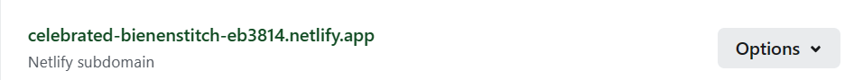

# 欢迎！

[](https://app.netlify.com/sites/celebrated-bienenstitch-eb3814/deploys)

这是一个新手的[个人空间](https://ljl2107.top/)  

[掘金的教程](https://juejin.cn/post/7190953007591194679#heading-4)  
通过这个我才真正学会怎么搞  
[hexo主题butterfly主题](https://butterfly.js.org/)  
在这里我也学会了怎么设置主题。  
就是很奇怪我使用`npm`确是不行的，用github是可以的。 
[hexo官网](https://hexo.io/zh-cn/docs/writing)  
# 快速开始
## 克隆项目
```
git clone https://github.com/ljl2107/hexoLBlog.git
```
## 安装包
```
npm insall
```
## 修改配置
```
到.yml文件里自行修改
```


# 操作
## 创建页面
```
hexo new page about
```
运行后会在项目的source文件夹中创建一个名为about的文件夹，其中有index.md文件，后面我们就在此文件中进行修改
```
---
title: 归档
date: 2023-01-18 15:02:14
type: archives
---
```
## 创建文章
```
hexo new text / hexo new post text
```
运行后会在项目的source/_posts文件夹中创建一个名为text.md的文件(如果开启了静态资源加载，则会创建一个同名文件夹)，后面我们就在此文件中进行修改
```
<!-- 以下是一些常用的文章配置 -->
---
title: hexo安装与部署
<!-- 标题 -->
copyright_author: jianliang
<!-- 作者 -->
copyright_author_href: /about/
<!-- 点击作者跳转页面 -->
copyright_info: 本文为原创文章，如需转载，请联系博主
tags: hexo
<!-- 标签 -->
categories: 博客
<!-- 分类 -->
top_img: top_img.jpg
<!-- 头图 -->
cover: top_img.jpg
<!-- 缩略图 -->
abbrlink: 17921
date: 2023-01-18 17:47:26
---
```

## 删除文章
删除本地文件。
终端命令如下：
```
hexo clean -> g -> d
```

## 创建草稿
```
hexo new draft name
```
刚刚提到了 Hexo 的一种特殊布局：draft，这种布局在建立时会被保存到 source/_drafts 文件夹，您可通过 publish 命令将草稿移动到 source/_posts 文件夹，该命令的使用方式与 new 十分类似，您也可在命令中指定 layout 来指定布局。
```
hexo publish [layout] <title>
```
草稿默认不显示
## 正文前部设置
用于设置文章的日期封面等内容
[front-matter正文前部设置](https://hexo.io/zh-cn/docs/front-matter)
[butterfly](https://butterfly.js.org/posts/dc584b87/#Post-Front-matter)
常用内容
> |   参数   |   描述   |
> | :-----: | :------: |
> |  cover  |  封面图  |
> | top_img | 顶部图片 |
> | title | 【必需】文章标题 |
> | date | 【必需】文章创建日期 |
> | tags | 标签 |
> | categories | 分类 |


# Netlify
[官网](https://app.netlify.com/)
## 华为云购买的域名在Netlify上进行注册。

快速添加解析里填入 netlify 给你提供的这个内容



# 后台

感觉使用命令行添加文章在未来会很麻烦，所以想整个后台方便一点，于是在网上搜索，果然有前辈准备好的内容。

* [Qexo](https://www.oplog.cn/qexo/start.html)
很不错。

# 图床
使用github有问题：422返回码
该问题已解解决，在Qexo的图床设置里仔细修改一下。
现在可以上传图片，并且在Qexo的后台可以看到，但是不能预览，真烂呢。
而且在测试的时候发现直接使用Qexo的原始github链接是不行的，图片不能访问。
****
所以目前方案是可以在Qexo上上传图片，然后在图床管理网址或者是软件`picgo`上复制链接进行导入文章。(利用自带的加速便可以了)
暂时先这样吧，看之后有没有更合适的方案。


>随机图做页面背景，效果很好哦。感谢[随机二次元图](https://www.loliapi.com/docs/acg/)
